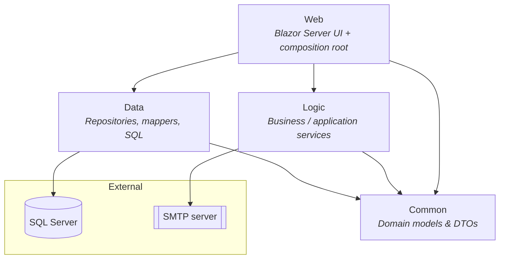

# Backlog Ticket Manager

A Blazor Server application for tracking and managing a backlog of support/work tickets, with cookie-based authentication, configurable email templates, and automatic email notifications for delayed or due-soon tickets.

Built on **.NET 8** with a clean, layered architecture and an ADO.NET (`System.Data`) data access layer backed by SQL Server.

---

## Solution structure

The solution (`BacklogTicketManager.sln`) is split into four projects, each with a single responsibility:

| Project | Type | Responsibility |
|---------|------|----------------|
| **Common** | Class library | Domain models and form/DTO types (`Ticket`, `User`, `EmailTemplate`, `TicketStatus`, `TicketPriority`, `LoginModel`, `RegisterModel`, …). No dependencies on other projects. |
| **Data** | Class library | Persistence layer. Repositories, `System.Data` mappers, XML-defined `DataTable` schemas, SQL connection factory, and SQL setup scripts. References `Common`. |
| **Logic** | Class library | Business/application services — authentication, ticket workflow, email templating and sending, and the background delayed-ticket monitor. References `Common`. |
| **Web** | ASP.NET Core (Blazor Server) | UI, composition root (`Program.cs`), Razor pages/components, authentication, and CSS bundling. References `Common`, `Data`, and `Logic`. |

**Dependency direction:** `Web → Logic / Data → Common`. Nothing depends on `Web`; `Common` depends on nothing.



---

## Architecture highlights

- **Layered / SRP design** — one class per concern, interfaces for every service and repository, wired up via constructor injection in `Web/Program.cs`.
- **Options pattern** — configuration is bound to typed options classes: `DatabaseOptions`, `SmtpOptions`, `NotificationOptions`, `CurrentUserOptions`.
- **`System.Data` data access** — `Microsoft.Data.SqlClient` with `DataTable`/`DataSet`/`DataRow`. Table structures are defined in XML schemas (`Data/Schema/Xml/*.xsd`) resolved through `IDataTableSchemaProvider`. Mappers translate between `DataRow`s and domain models.
- **Cookie authentication** — custom cookie auth backed by the `Users` table. Every endpoint requires an authenticated user by default (`FallbackPolicy`); only Login/Register/logout and the CSS bundle are `[AllowAnonymous]`.
- **Background notifications** — `DelayedTicketMonitorService` (an `IHostedService`) polls on an interval and raises delay / due-soon emails through the templating and SMTP pipeline.
- **CSS bundling** — `StyleBuilder` concatenates every `wwwroot/css/*.css` file into a single stylesheet served (with ETag caching) at `/css/bundle.css`.

---

## Key features

- **Ticket backlog** — create, view, and update tickets with status and priority (`Backlog`, `NewTicket`, `TicketDetails` pages).
- **Authentication** — sign-in and sign-up with cookie sessions (8-hour sliding expiration). A default `admin` account is seeded on first run for local/dev use.
- **Email templates** — designer-backed, configurable templates (`EmailTemplates` page) stored in SQL.
- **Email log** — history of sent notifications (`EmailLog` page).
- **Automatic notifications** — background service emails on delayed or soon-due tickets.

---

## Getting started

### Prerequisites

- [.NET 8 SDK](https://dotnet.microsoft.com/download/dotnet/8.0)
- SQL Server (local instance or container)

### Database setup

Run the SQL scripts in `Data/Scripts/` in order against your target database:

1. `001_CreateSchema.sql`
2. `002_CreateEmailTemplatesTable.sql`
3. `003_CreateUsersTable.sql`

### Configuration

Configure `Web/appsettings.json` (or user secrets / environment variables):

- `ConnectionStrings:BacklogDatabase` — SQL Server connection string.
- `Smtp` — SMTP host, port, credentials, and from-address for outgoing mail.
- `Notification` — polling interval, due-soon window, re-notify window, and default recipient.
- `CurrentUser` — default display name/email context.

> **Security note:** Do not commit real connection strings, SMTP passwords, or the seeded admin credentials. Use [user secrets](https://learn.microsoft.com/aspnet/core/security/app-secrets) or environment variables for anything sensitive, and change/remove the default `admin` account before deploying to production.

### Build and run

```bash
dotnet restore
dotnet build
dotnet run --project Web
```

The app launches at the URL shown in `Web/Properties/launchSettings.json`. On first run a default administrator account is seeded:

| Field | Value |
|-------|-------|
| Username | `admin` |
| Password | `Admin@123` |

**Change or remove these credentials for any non-local environment.**

---

## Tech stack

- .NET 8 / ASP.NET Core Blazor Server
- `Microsoft.Data.SqlClient` (ADO.NET, `System.Data`)
- Cookie authentication (`Microsoft.AspNetCore.Authentication.Cookies`)
- `Microsoft.Extensions.Options` for typed configuration
- SMTP for email delivery

---

## Further documentation

Additional generated documentation lives in the [`docs/`](docs/) folder (solution report in `.docx` and `.pdf`).
